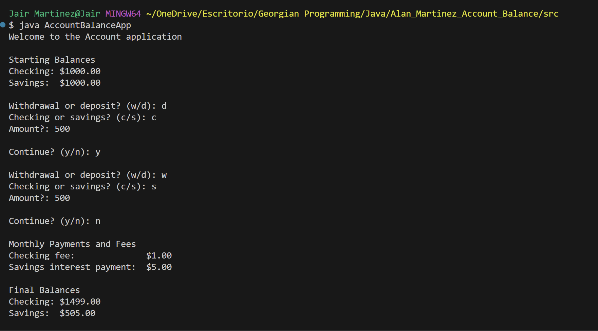
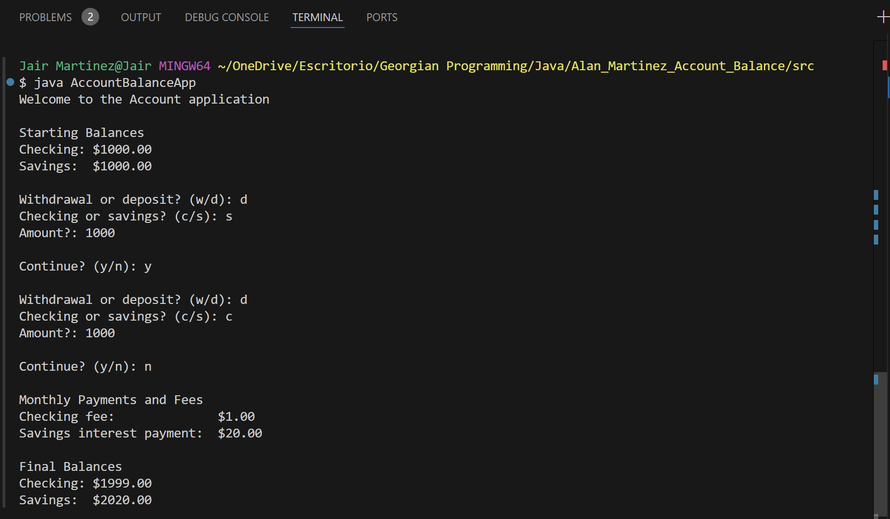
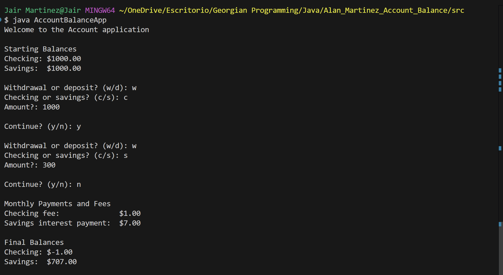

# Account Balance Calculator

This is a Java console application that calculates and displays the starting and ending monthly balances for checking and savings accounts.

## How to Run the Project

1. Compile the code:
   javac \*.java

2. Run the application:
   java AccountBalanceApp

## Features

- Deposit and withdraw from accounts.
- Apply monthly fees and interest.

## Sample Output

Here is a sample output of the application:

